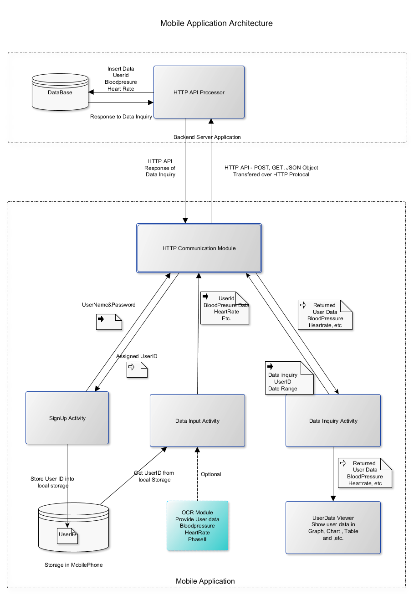
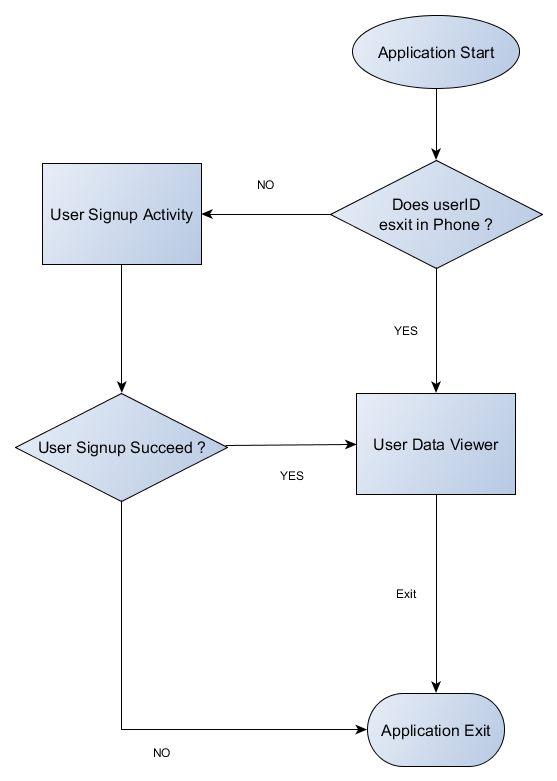

# Mobile Application Architecture Design

# Mobile/Server Communication Protocol
Mobile App will use HTTP protocol to communication with server. On server side there is a HTTP API processor module will process the requests sent from Mobile App.
HTTP API POST and GET will be used for the data input/output operations.
 
# Communication Message Format
The JSON format will be used for communication over HTTP protocol
Example of Message
***{“name”: “tongliu”, “systolic”:”120”, “biastolic”: “80”, “heart rate”: “85”}***

# Sign up Activity
* User Sign up process:
- User sign up process is one time process. When application starts, it will check if a pre assigned userID is exist in phone's local storage.
In case of the userID is exist, the app will move to user data viewer. If the userID is not exist, app will move to user sign up activity. See below flowchart.

- At user sign up activity, user will be required to input username and user password which are arranged by doctor’s clinic, and submit these information via HTTP API to server “http://hostname/api/signup”, once user information is verified server will send an unique userID back to app. This userID will be save in phone’s local storage by app, then app will move to user data viewer.  

# User Data input Activity
User data input via on screen keypad 
User data input process
userdatainput activity class based off data_input view, when the submit button is clicked get value from textviews - such as, systolic, diastolic, heartrate. Also,  get date and userID data from phone system. Finally userdatainput activity will put these information in a  json object, and sent to server “http://hostname/api/userdatainput/” by POST command over HTTP communication. 
The format of user data input message show as below.
***{“userid”: ”1”, “name”: “tongliu”, “systolic”:”120”, “biastolic”: “80”, “heart rate”: “85”, “date”: “02-28-2019”}***

* User data input by camera - optional second phase

# User Data inquiry Activity
User Data Inquiry Process
User Data inquiry activity will be called by user data viewer automatically when user data viewer is launched, and also can be called when UserDataViewer’s update event happened. The activity send data inquiry message to “http://hostname/api/inquiry/” with format message show as below.
***{“userid”: ”1”, “start date”: “02-28-2019”, “end date”: “03-01-2019”}***
Server application will response to this inquiry with json format message:
***{ {“02-28-2019”, “systolic”:”120”, “biastolic”: “80”, “heart rate”: “85”},
       {“03-01-2019”, “systolic”:”110”, “biastolic”, “75”, “heart rate”, “80”}}***

# User data Viewer
User data viewer includes types viewer activities. These activities are based on user data inquiry activity to get user data from server.
* User data table view
In table type of view, app will list user data in a tableview within a chosen date range.     
* User data graph view
In graph type of view, app will show user data in 2-D line graphic chart based on historical data in for a chosen date range.

