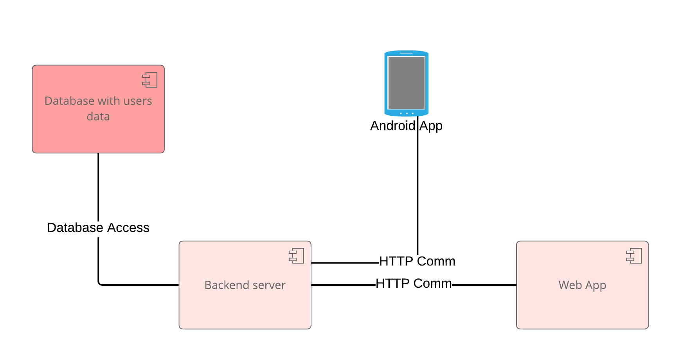
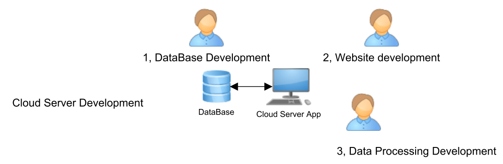
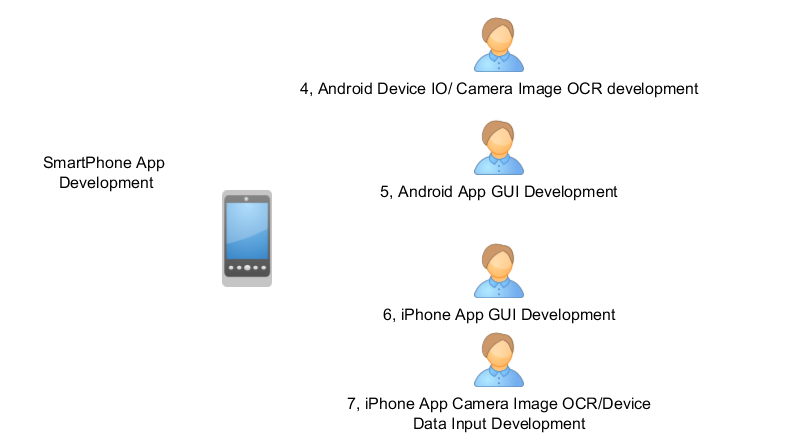

# MISSION STATEMENT

### Overview

The goal of this project is to build a cloud-based personal health management system. Personalized health management system can help patients to track their health related data comfortably, increase prevention, detect risks and make the communication between patient and doctor easier and more efficient.

### System Description

Server-side application is deployed on a service-based cloud server. The frontend is a smartphone app. In the first phase, an Android phone is considered as a client device, it is possible to expand to an iPhone app in the next phase. Also, the initial version of the system will only capture blood pressure and heart rate information. Once this data is succesfully captured and processed, the system capabilities could expand to add more information such as gym workout information, etc.

### Backend

On the server side, all data received from the mobile app will be stored into a database indexed by the user’s name, date of birth or other. The server shall be able to run a data analysis process to show, analyze and detect risks based on user data trends. Server application shall also be able to show a visual representation of user data via graphs or other on a webpage. This webpage interface would enable doctors to monitor or review patient’s health status, evaluate and make decisions based on that health information.

### Mobile app

The Android phone app will provide data input functionalities for this system. It would be able to input blood pressure and heart rate information manually, or input via OCR (optical character recognition) based text, auto reading from an image which is taken by phone camera. Android phone shall collect this blood pressure information – high, low, pulse, store most recent data on the phone and at the same time forward this information to the server and store them on the server permanently. Application shall also be able to visualize user data on a graph within the GUI.
